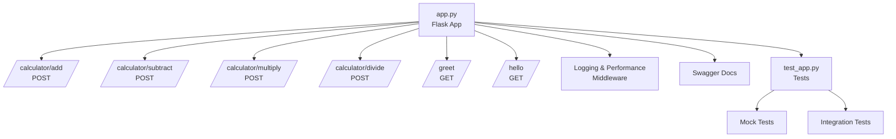

# Demo app for the github copilot training course
This is a simple demo app to showcase the capabilities of GitHub Copilot.
Web application built with Python Flask

Application is **CALCULATOR** that can perform basic arithmetic operations.

## Features
REST API with the following endpoints:
- `GET /add`: Adds two numbers
- `GET /subtract`: Subtracts two numbers
- `GET /multiply`: Multiplies two numbers
- `GET /divide`: Divides two numbers

